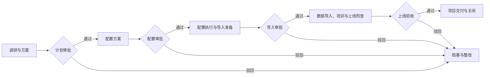
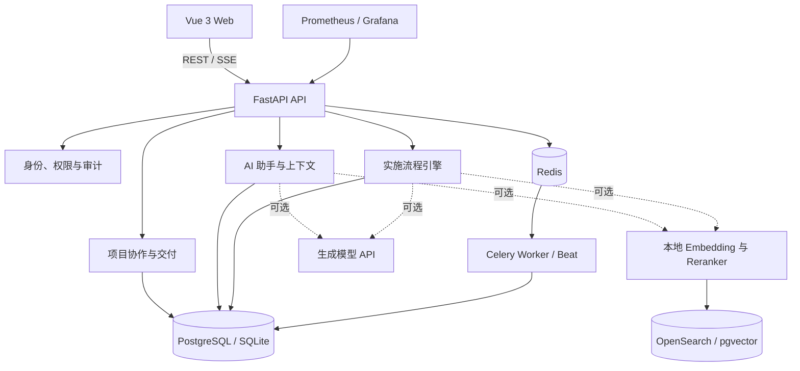

# SaaS Delivery Hub

面向企业 SaaS 上线实施的多租户项目交付与协作平台。

SaaS Delivery Hub 将需求收集、实施计划、知识检索、配置变更、数据导入、培训、审批和上线验收组织到同一个可恢复、可审计的交付流程中。

> 当前仓库是一套可运行的参考实现，适合本地开发、功能验证和实施流程演示。默认配置使用确定性执行和离线检索；真实生成模型、向量检索、邮件服务及异步 Worker 需要单独配置和验收。

## 目录

- [项目定位](#项目定位)
- [核心能力](#核心能力)
- [实施流程](#实施流程)
- [系统架构](#系统架构)
- [技术栈](#技术栈)
- [快速开始](#快速开始)
- [本地开发](#本地开发)
- [配置说明](#配置说明)
- [项目结构](#项目结构)
- [API 与服务入口](#api-与服务入口)
- [测试与质量检查](#测试与质量检查)
- [部署与安全边界](#部署与安全边界)
- [项目文档](#项目文档)
- [参与贡献](#参与贡献)

## 项目定位

SaaS Delivery Hub 的核心定位是 **企业 SaaS 实施交付中枢**，服务于 SaaS 厂商实施团队、客户项目负责人、审批人和平台运营人员。

它不是通用项目管理工具，也不是单纯的 RAG 知识库。平台围绕“客户从签约后到正式上线”这一过程，提供四类能力：

1. **交付管理**：把需求、计划、配置、导入、培训和验收沉淀为结构化项目资产。
2. **项目协作**：支持多成员、多公司协作、任务分配、文档提交和成果审批。
3. **AI 辅助**：基于授权资料进行问答、检索、差距分析、计划生成和上下文记忆。
4. **流程治理**：通过权限、人工审批、职责分离、幂等控制和审计记录约束高风险操作。

## 核心能力

### 项目与交付

- 管理 SaaS 实施项目、客户需求、目标上线日期和项目生命周期。
- 生成并保存实施计划、配置方案、导入记录、培训材料和验收报告。
- 通过 Server-Sent Events（SSE）展示执行进度和状态变化。
- 支持失败、取消、阻塞后的修订、重试和同一执行实例恢复。

### 团队协作

- 在项目下创建任务、分配负责人、设置截止日期并跟踪状态。
- 任务成果需要提交项目文档并通过独立审批后才能完成。
- 支持跨公司项目协作，同时保持租户、成员和项目角色边界。
- 支持个人空间、公司空间、项目成员和临时能力授权。

### 知识库与 RAG

- 支持 Markdown、TXT、DOCX、CSV、JSON、PDF、PPTX 和 XLSX 知识文档。
- 支持扫描 PDF OCR，以及页码、幻灯片和工作表级来源定位。
- 提供关键词、向量、RRF 融合和重排组成的混合检索链路。
- 文档按租户、项目、版本、状态和用户权限进行过滤。
- 提供独立的 RAG 查验、评估和索引运维能力。

### AI 助手

- 支持多轮对话、SSE 流式回答、来源引用和问题澄清。
- 可检索企业知识、项目资料、会话附件和最新交付物。
- 支持滚动摘要、私有历史召回和用户可管理的分作用域记忆。
- 提供受当前用户权限约束的只读 MCP 检索接口。
- 未配置真实模型时明确使用离线模式，不伪造模型回答。

### 权限与治理

- 平台账号和客户账号使用独立入口、会话上下文及权限体系。
- 权限由公司身份、项目角色、临时能力和支持访问授权共同决定。
- 计划、配置、导入和上线验收设置人工审批节点。
- 高风险操作执行职责分离，发起人不能批准自己的请求。
- 关键写操作支持幂等键、版本冲突检测和完整审计记录。
- PostgreSQL 环境对核心业务表启用 Row-Level Security（RLS）。

## 实施流程

平台将完整实施过程划分为五个阶段，并在关键节点等待人工确认：



底层工作流包含 17 个持久化节点。每个节点都会记录结构化状态和执行轨迹；模型可以在阶段内补充检索、提出动作或重新规划，但不能跳过业务前置条件、修改已批准材料或自行完成审批。

## 系统架构



默认开发模式可以只使用 SQLite 和确定性逻辑运行。完整部署使用 PostgreSQL、Redis、Celery、OpenSearch、本地检索模型和可选的生成模型服务。

## 技术栈

| 层级 | 技术 |
| --- | --- |
| 前端 | Vue 3、TypeScript、Pinia、Vue Router、Vite |
| API | FastAPI、Pydantic、SQLAlchemy Async、Uvicorn |
| 数据库 | PostgreSQL 16、pgvector、Alembic；开发环境支持 SQLite |
| 异步任务 | Celery、Redis、事务 Outbox |
| AI 与检索 | 兼容 OpenAI 风格的模型接口、BGE Embedding、BGE Reranker、OpenSearch |
| 文档处理 | pypdf、PDFium、Tesseract OCR、python-pptx、openpyxl |
| 可观测性 | Prometheus、Grafana、OpenTelemetry |
| 质量工具 | pytest、Ruff、mypy、vue-tsc |

## 快速开始

### 使用 Docker Compose

要求：

- Docker Engine 或 Docker Desktop
- Docker Compose v2

复制环境变量文件：

```bash
cp .env.example .env
```

Windows PowerShell：

```powershell
Copy-Item .env.example .env
```

首次启动前，至少修改 `.env` 中的以下值：

```dotenv
SAAS_DB_PASSWORD=replace-with-a-strong-password
SAAS_APP_DB_PASSWORD=replace-with-another-strong-password
BOOTSTRAP_ADMIN_EMAIL=admin@example.com
BOOTSTRAP_ADMIN_PASSWORD=replace-with-a-strong-password
```

启动默认开发栈：

```bash
docker compose up --build
```

后台启动：

```bash
docker compose up -d --build
```

服务启动后访问：

| 服务 | 地址 |
| --- | --- |
| 用户端 | <http://localhost:8080> |
| 用户注册 | <http://localhost:8080/register> |
| 平台管理端 | <http://localhost:8080/platform/login> |
| API 文档 | <http://localhost:8000/docs> |
| Prometheus | <http://localhost:9090> |
| Grafana | <http://localhost:3000> |

`migrate` 服务会在 API 启动前创建最小权限数据库角色、执行 Alembic 迁移并授予所需权限。首次平台登录使用 `.env` 中配置的 `BOOTSTRAP_ADMIN_EMAIL` 和 `BOOTSTRAP_ADMIN_PASSWORD`。公开部署前不得保留示例凭据。

常用运维命令：

```bash
# 查看服务状态
docker compose ps

# 查看 API 日志
docker compose logs -f api

# 重新构建并启动
docker compose up -d --build

# 停止服务并保留数据卷
docker compose down
```

> 不要在需要保留数据时执行 `docker compose down -v`，该命令会删除 Compose 管理的数据卷。

### 启用真实 RAG

真实 RAG 需要本地检索模型、OpenSearch、索引 Worker 和对应配置。请先阅读 [本地 RAG 部署说明](docs/RAG_LOCAL_SETUP.md) 与 [CPU 检索说明](docs/RAG_CPU.md)，再启动 `rag`、`agent` 和 `model-setup` profiles。

不要仅通过修改 `RAG_MODE` 就将真实检索投入生产。模型版本、索引身份、重排服务、发布文件和人工评估结果必须保持一致。

## 本地开发

### 后端

要求 Python 3.11 或更高版本。

```bash
python -m venv .venv
```

激活虚拟环境：

```bash
# Linux / macOS
source .venv/bin/activate

# Windows PowerShell
.venv\Scripts\Activate.ps1
```

安装依赖并初始化数据库：

```bash
python -m pip install -e ".[dev]"
cp .env.example .env
python -m alembic upgrade head
python -m uvicorn backend.main:app --reload
```

Windows 可在依赖已经安装后使用项目启动脚本：

```powershell
.\start.ps1
```

该脚本会按需构建前端、备份本地 SQLite 数据库、执行迁移，然后在 <http://127.0.0.1:8000> 同源提供 Web 和 API。

### 前端

要求 Node.js 22 或兼容版本，以及 pnpm。

```bash
cd frontend
corepack enable
pnpm install
pnpm dev
```

前端开发服务器默认运行在 <http://localhost:5173>，并将 `/api` 和 `/health` 代理到 <http://localhost:8000>。

## 配置说明

所有可公开配置示例位于 [.env.example](.env.example)。真实 `.env`、API 密钥、数据库文件、日志和备份不应提交到版本库。

### 基础配置

| 变量 | 示例值 | 用途 |
| --- | --- | --- |
| `DATABASE_URL` | SQLite | API 使用的异步数据库连接 |
| `POSTGRES_DB` | `saas_agent` | Compose PostgreSQL 数据库名称 |
| `REDIS_URL` | `redis://redis:6379/0` | 限流、队列和任务协调 |
| `COOKIE_SECURE` | `false` | 生产 HTTPS 环境应设为 `true` |
| `REQUIRE_VERIFIED_EMAIL_FOR_COMPANY` | `false` | 是否要求验证邮箱后才能创建公司 |
| `EXECUTION_MODE` | `inline` | `inline` 或异步 `worker` 执行 |

### AI 与流程配置

| 变量 | 示例值 | 用途 |
| --- | --- | --- |
| `MODEL_MODE` | `deterministic` | 确定性模式或真实生成模型模式 |
| `MODEL_API_STYLE` | `chat_completions` | 模型 API 协议风格 |
| `MODEL_BASE_URL` | 空 | 生成模型服务地址 |
| `MODEL_NAME` | `qwen-plus` | 生成模型名称示例 |
| `MODEL_API_KEY` | 空 | 生成模型访问密钥 |
| `AGENT_ENGINE` | `legacy` | 新建执行实例使用的流程引擎版本 |
| `AGENT_TOKEN_BUDGET` | `120000` | 单次实施执行的累计模型预算上限 |

### 检索与上下文配置

| 变量 | 示例值 | 用途 |
| --- | --- | --- |
| `RAG_MODE` | `mock` | 离线检索或真实 RAG |
| `RAG_V3_INDEXING_ENABLED` | `true` | 是否启用 V3 文档索引 |
| `RAG_PDF_ENABLED` | `true` | 是否允许 PDF 解析与索引 |
| `RAG_OFFICE_ENABLED` | `true` | 是否允许 PPTX/XLSX 解析与索引 |
| `CHAT_CONTEXT_MODE` | `off` | 新上下文策略的关闭、影子或启用模式 |
| `CHAT_HISTORY_ENABLED` | `false` | 是否启用独立消息历史与混合召回 |
| `CHAT_MEMORY_ITEMS_ENABLED` | `false` | 是否启用分作用域私有记忆 |
| `CHAT_MEMORY_CANDIDATES_ENABLED` | `false` | 是否允许用户选择启用记忆候选提取 |

更完整的变量、模型版本和部署组合请直接查看 [.env.example](.env.example) 及 `config/` 下的环境模板。

## 项目结构

```text
.
├── backend/                 # FastAPI、业务逻辑、权限、流程、聊天和 RAG
├── frontend/                # Vue 3 用户端与平台管理端
├── alembic/                 # 数据库迁移
├── config/                  # RAG 与检索服务配置模板
├── docs/                    # 产品、架构、部署和运维文档
├── evaluations/             # 检索与上下文评估数据和报告
├── knowledge/               # 本地模型及知识资料说明
├── scripts/                 # 部署、备份、恢复、验证和评估脚本
├── skills/                  # 实施文书 Skill 与结构化模板
├── tests/                   # 单元、集成、浏览器和数据库验收测试
├── docker-compose.yml       # 默认开发栈
├── Dockerfile               # API 镜像
├── Dockerfile.retrieval     # 本地检索服务镜像
├── pyproject.toml           # Python 项目与质量工具配置
└── start.ps1                # Windows 本地一键启动入口
```

## API 与服务入口

主要 API 分组如下：

| 分组 | 路径 | 用途 |
| --- | --- | --- |
| 认证与注册 | `/api/auth` | 登录、注册、邀请、空间切换和密码管理 |
| 项目 | `/api/projects` | 项目、成员、文档、任务和协作公司 |
| 实施执行 | `/api/projects/{id}/runs`、`/api/runs` | 创建、取消、恢复、轨迹和事件流 |
| 审批 | `/api/approvals` | 查询和处理人工审批 |
| 导入与交付 | `/api/imports`、`/api/artifacts` | 数据校验、执行、交付物预览和下载 |
| 知识库 | `/api/knowledge` | 文档上传、查验、索引和版本管理 |
| AI 助手 | `/api/chat` | 对话、附件、上下文和记忆 |
| MCP | `/api/mcp` | 当前会话授权范围内的只读检索工具 |
| 公司治理 | `/api/company` | 成员、邀请、审计、导出和支持访问 |
| 平台治理 | `/api/platform` | 公司、账号、系统状态和评估管理 |
| 健康与指标 | `/health`、`/ready`、`/metrics` | 存活、就绪和 Prometheus 指标 |

启动 API 后，可在 <http://localhost:8000/docs> 查看完整 OpenAPI 交互文档。

## 测试与质量检查

后端：

```bash
python -m pytest -q
python -m ruff check backend tests
python -m mypy backend
```

前端：

```bash
cd frontend
pnpm typecheck
pnpm build
```

测试覆盖认证、租户隔离、权限、项目协作、审批并发、状态机、导入、交付、聊天、上下文、RAG、索引生命周期和部署不变量。浏览器测试和 PostgreSQL/RLS 验收需要按测试文件说明显式启用相应环境。

检索质量评估位于 `evaluations/`。自动化指标主要用于回归诊断；在独立人工复核、真实客户资料验证和生成回答评分完成前，不应将其解释为生产质量承诺。

## 部署与安全边界

`docker-compose.yml` 面向本地开发和功能验证，不是可以直接暴露到公网的生产配置。正式部署至少需要：

- 使用 HTTPS，并启用安全 Cookie。
- 为数据库、应用会话、邮件和模型服务使用独立密钥管理。
- 分离迁移账号与最小权限应用账号，保留 PostgreSQL RLS。
- 使用正式 SMTP、持久化对象存储、备份保留策略和恢复演练。
- 限制 PostgreSQL、Redis、OpenSearch、Prometheus 和 Grafana 的网络访问。
- 运行单实例 Beat 以及独立的业务 Worker 和索引 Worker。
- 对真实模型、真实语料、引用正确性、故障恢复和成本进行上线验收。

项目内置的目标 SaaS 配置和成员数据用于验证实施闭环。接入真实第三方 SaaS 时，应通过受控连接器扩展，并继续遵守现有授权、审批、幂等和审计边界。

## 项目文档

| 文档 | 内容 |
| --- | --- |
| [项目协作](docs/PROJECT_COLLABORATION.md) | 项目文档、任务流转和成果审批 |
| [交付实现](docs/DELIVERY_IMPLEMENTATION.md) | 配置、导入、交付物和验收实现边界 |
| [AI 助手](docs/AI_CHAT.md) | 对话、附件、项目资料和引用机制 |
| [聊天工具链](docs/CHAT_AGENT.md) | 流式回答、工具调用、MCP 和授权检索 |
| [上下文与记忆](docs/CONTEXT_MEMORY.md) | 摘要、历史召回、记忆和预算策略 |
| [流程引擎与 RAG](docs/AGENT_RAG.md) | 阶段内规划、恢复、经验和混合检索 |
| [二进制文档](docs/RAG_BINARY_DOCUMENTS.md) | PDF、OCR、PPTX 和 XLSX 处理 |
| [本地 RAG](docs/RAG_LOCAL_SETUP.md) | 本地模型、OpenSearch 与索引部署 |
| [预生产运行手册](docs/PREPRODUCTION_RUNBOOK.md) | 隔离部署、初始化、备份和验证 |
| [生产安全审查](docs/PRODUCTION_SAFETY_REVIEW.md) | 上线前安全边界与检查项 |
| [仓库结构](docs/REPOSITORY_LAYOUT.md) | 目录职责和清理边界 |

## 参与贡献

欢迎通过 Issue 提交问题、复现步骤和预期行为，通过 Pull Request 提交改进。

提交前请确保：

- 后端测试、Ruff 和 mypy 通过。
- 前端类型检查和生产构建通过。
- 数据库结构变更包含 Alembic 迁移及兼容性验证。
- 权限、审批或检索变更包含对应的隔离与回归测试。
- 测试数据、日志、截图和提交历史中不包含客户资料、密钥或内部文档。

### Docker 构建下载超时

如果构建期间访问 PyPI 超时，可直接重试：

```bash
docker compose up --build
```

后端镜像默认使用 120 秒下载超时、10 次连接重试和 BuildKit pip 缓存。仍无法访问时，可以在 `.env` 中将 `DOCKER_PIP_INDEX_URL` 指向可信的 Python 包镜像，并按需调整 `DOCKER_PIP_TIMEOUT` 与 `DOCKER_PIP_RETRIES`。
